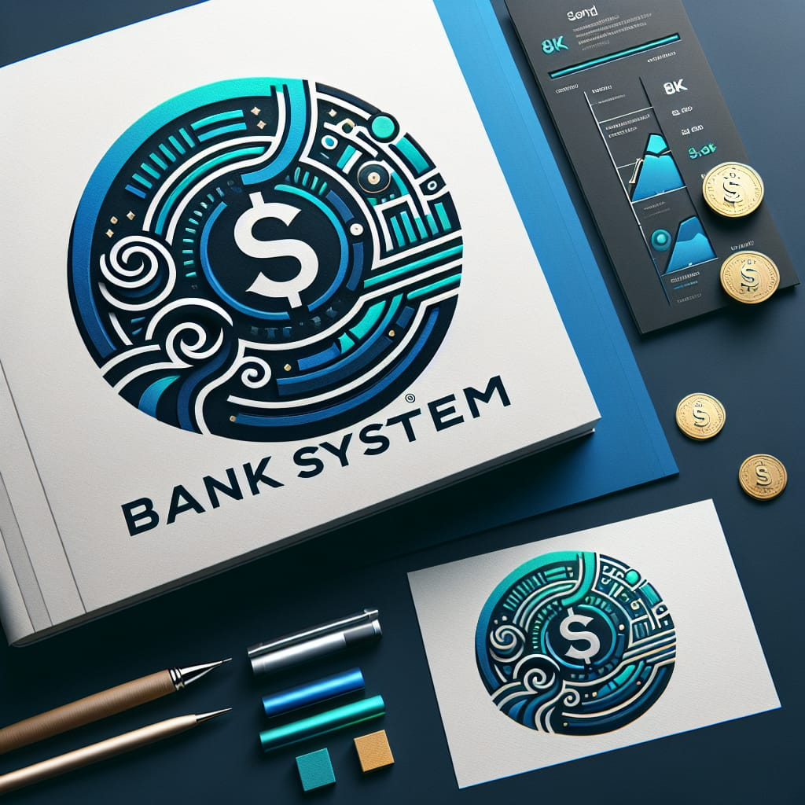

# **Projeto Bank System**

 

### **``Sobre:``**

O projeto é focado em construir um sistema bancario, partindo de três desafios propostos: 

1. O primeiro deles proponhe uma abordagem mais simples utilizando apenas estruturas de controle basicas:

    **Desafio:** [Criando um Sistema Bancário com Python](pp/pp_bank_system.py)

2. O segundo proponhe uma abordagem mais modular utilizando funções:

    **Desafio:** [Otimizando o Sistema Bancário com Funções Python](fp/fp_bank_system.py)

3. Por fim é utilizado o paradigma orientado a objetos:

    **Desafio:** [Modelando o Sistema Bancário em POO com Python](oop/oop_bank_system.py)

Agora para complementar o conhecimento vamos além dos desafios propostos, implementando novas funcionalidades e otimizando o código:

**Desafio pessoal:** [Indo Além do Basico]()